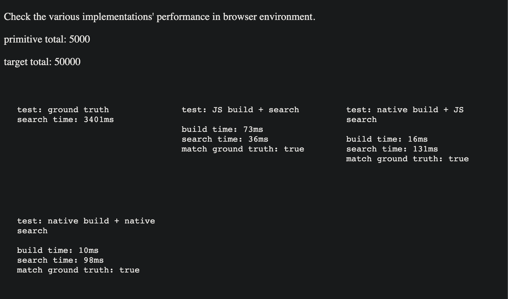
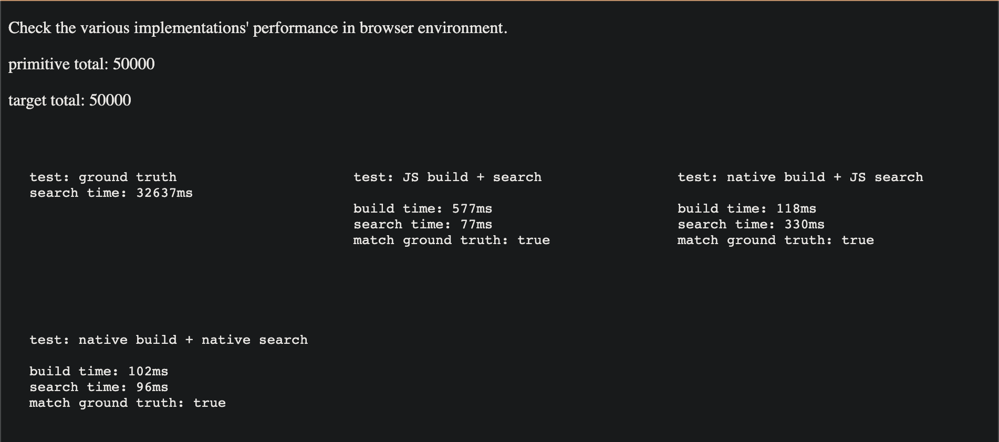
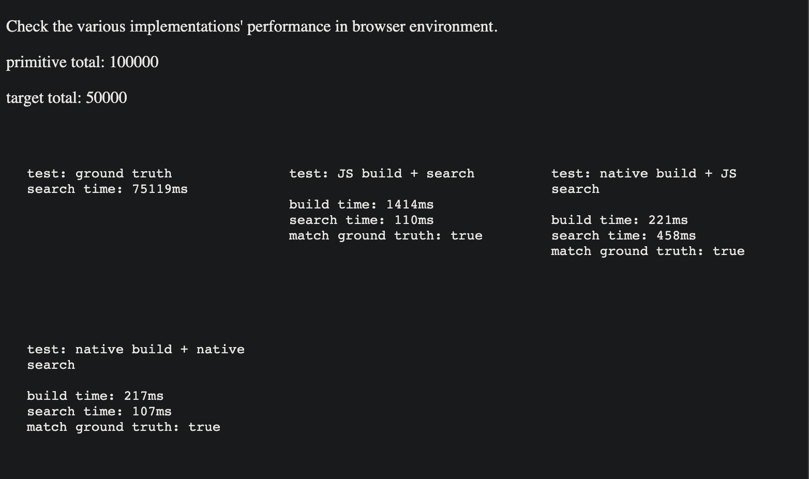

# 3d-space-query

## Planned development work:
- [x] add a JS version of the single-threaded implementation
- [x] add a WASM verion of the single-threaded implementation
- [x] add basic UTs monitoring the different implementations' correctness
  - [x] JS implementation (single-threaded)
  - [x] WASM implementation (single-threaded)
- [x] add basic script running benchmark tasks against different implmenetations. And set up intuitive speed/performance expectation. 
  - in term of speed:
    - multi-threaded is faster than single threaded
    - wasm is faster than JS (wasm searching is significantly slower in browser at this moment, needs further investigation.)
    - performance gain grows as the input scales up
  - in term of memory usage:
    - multi-threaded uses more than single-threaded
    - wasm uses more than JS
- [ ] migrate benchmarking code to web worker
- [ ] replace CMake with Bazel
- [ ] introduce emscripten docker for building wasm module
- [ ] enrich the supported geometric query
  - [x] initial support: aabb
  - [ ] later support: ray
- [ ] add a multi-threaded implementation in JS
  - [ ] build
  - [ ] search - optional
- [ ] add a multi-threaded implementation in wasm (might replace the single threaded wasm implementation if possible)
  - [ ] build
  - [ ] search - optional
- [ ] (bonus) migrate multi-threaded implementations to GPU if possible

## Example Screenshots:
* index 5000 boxes + check 50000 targets
  

* index 50000 boxes + check 50000 targets
  

* index 100000 boxes + check 50000 targets
  
